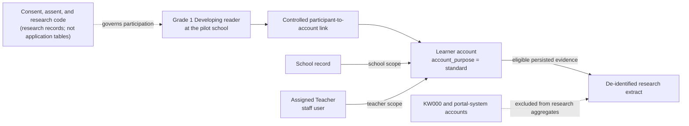
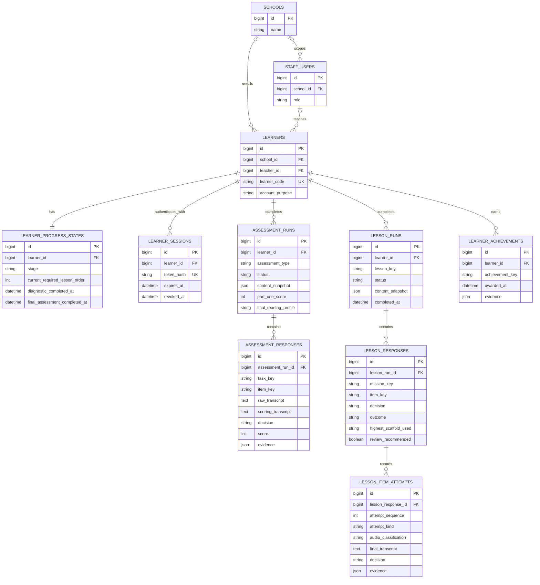
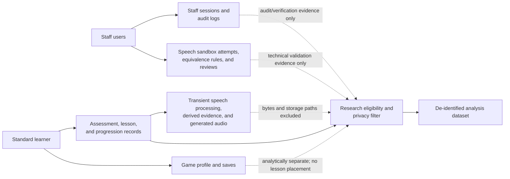
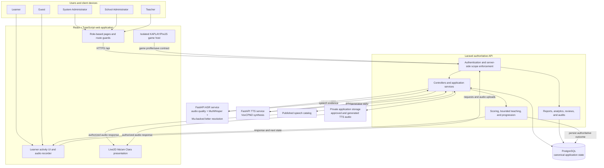
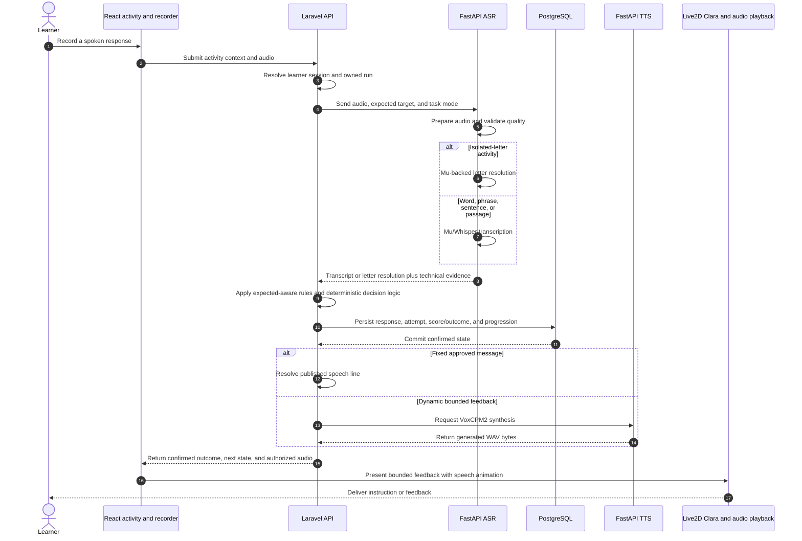
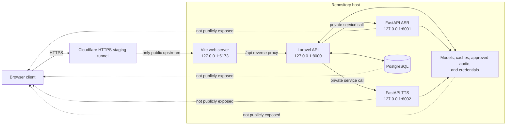

# Chapter 3 ASCII Diagrams: Figures 4-6

This document provides paste-ready ASCII diagrams for the three remaining
Chapter 3 figures. The diagrams reflect the current ReaDirect V2 repository,
database migrations, API boundaries, and research-design limitations.

For best alignment in a manuscript, use a monospaced font such as Consolas or
Courier New and keep each diagram in landscape orientation if necessary.

## Figure 4 - ReaDirect Research and System Data Model

```text
+--------------------------- RESEARCH CONTEXT ----------------------------+
| Grade 1 Developing reader at the pilot school                           |
|                                                                         |
| Consent/assent and research code are research records, not application  |
| tables. Direct identifiers must not be included in analysis outputs.    |
+------------------------------------+------------------------------------+
                                     |
                                     | controlled participant-to-account link
                                     v
+---------------------------- SYSTEM IDENTITY ----------------------------+
|                                                                        |
|  +----------+       1:N       +-------------+      1:N      +---------+ |
|  | schools  |---------------->| staff_users |-------------->| learners| |
|  +----------+                 | teacher role|               +----+----+ |
|       | 1:N                    +------+------+                    |      |
|       +----------------------------------------------------------+      |
|                           school scope                            |      |
+------------------------------------------------------------------|------+
                                                                   |
                          one authenticated learner                 |
            +----------------------+----------------------+---------+---------+
            |                      |                      |                   |
            v                      v                      v                   v
 +----------------------+ +------------------+ +------------------+ +----------------+
 | learner_progress_    | | assessment_runs  | | lesson_runs      | | learner_       |
 | states               | |                  | |                  | | achievements   |
 |----------------------| | type:            | | lesson_key       | +----------------+
 | current stage        | | - diagnostic     | | mission/status   |
 | current lesson       | | - final          | | content snapshot |
 | completion times     | | scores/profile   | +--------+---------+
 +----------------------+ | content snapshot |          | 1:N
                          +--------+---------+          v
                                   | 1:N       +------------------+
                                   v           | lesson_responses |
                          +------------------+ |------------------|
                          | assessment_      | | transcript       |
                          | responses        | | decision/outcome |
                          |------------------| | scaffold/review  |
                          | task/item        | +--------+---------+
                          | selected answer  |          | 1:N
                          | raw + scoring    |          v
                          | transcript       | +------------------+
                          | score/decision   | | lesson_item_     |
                          | audio evidence   | | attempts         |
                          +--------+---------+ |------------------|
                                   |           | academic attempt |
                                   |           | technical retry  |
                                   |           | transcript/audio |
                                   |           | decision/evidence|
                                   |           +--------+---------+
                                   |                    |
                                   +---------+----------+
                                             |
                                             v
                             +-------------------------------+
                             | DE-IDENTIFIED RESEARCH EXTRACT|
                             |-------------------------------|
                             | paired diagnostic/final data  |
                             | task scores and reading result|
                             | skips and completion evidence |
                             | no passwords/private paths    |
                             +-------------------------------+

 Supporting but analytically separate system data:

 +----------------------+   +----------------------+   +----------------------+
 | staff_sessions and   |   | speech sandbox,     |   | game profile/saves   |
 | staff_audit_logs     |   | equivalence rules,  |   | (optional activity;  |
 | (security/audit)     |   | response reviews    |   | not lesson placement)|
 +----------------------+   +----------------------+   +----------------------+
```

### Figure 4A - Research Context and Controlled Identity Linkage



**Figure 4A. Research Context and Controlled Identity Linkage.** Research
consent, assent, and participant codes remain outside the operational database.
Only an authorized controlled link connects a participant to a standard learner
account. Portal-system accounts such as `KW000` are excluded from the research
extract.

### Figure 4B - Implemented Academic and Progress Data Relationships



**Figure 4B. Implemented Academic and Progress Data Relationships.** Schools
scope staff and learners, while each learner owns one canonical progression
record and may own multiple assessment and lesson runs. Runs preserve immutable
content snapshots and contain the response-level evidence used by Laravel.
Lesson responses additionally retain bounded-teaching attempts and scaffold
outcomes.

### Figure 4C - Supporting System Data and Research Extraction Boundary



**Figure 4C. Supporting System Data and Research Extraction Boundary.** The
research dataset is derived through an explicit eligibility and privacy filter.
Academic records provide learner-outcome evidence; sandbox and audit records
may provide separate technical-validation evidence. Private media locations,
credentials, and direct identifiers do not enter the de-identified dataset.
Game saves remain separate from assessment scoring and required lesson
progression.

**Figure 4. ReaDirect Research and System Data Model.** A participant is linked
under controlled conditions to one learner account. The learner owns the
canonical progression state and the persisted assessment, lesson, achievement,
and optional game records. Assessment and lesson responses preserve the
evidence used by Laravel, while the research dataset is a derived,
de-identified extract rather than a public application table. Diagnostic and
Final Assessment runs are distinguished by `assessment_type`, which permits a
within-learner pretest-posttest comparison without mixing portal-system data.

Accuracy notes:

- The implemented application tables are `schools`, `staff_users`, `learners`,
  `learner_progress_states`, `assessment_runs`, `assessment_responses`,
  `lesson_runs`, `lesson_responses`, `lesson_item_attempts`, and
  `learner_achievements`.
- `KW000` and all records with `account_purpose = portal_system` are technical
  Page Portal evidence and must be excluded from live learner research
  aggregates.
- Private audio paths and checksums may support authorized review, but they
  must not appear in ordinary dashboards or de-identified research outputs.
- Game state is separate from the required reading progression and must not be
  used to skip lessons or determine assessment scores.

## Figure 5 - ReaDirect V2 System Architecture

```text
 +-------------------- USERS / CLIENT DEVICES --------------------+
 | System Admin | School Admin | Teacher | Learner | Guest        |
 +------------------------------+---------------------------------+
                                |
                                | HTTPS / browser interaction
                                v
 +---------------------- REACT + TYPESCRIPT WEB APP ----------------------+
 | Vite single-page application                                          |
 | - role-based pages and route guards                                    |
 | - learner recorder and activity UI                                     |
 | - Live2D Ma'am Clara presentation                                      |
 | - isolated KAPLAY/PixiJS game-module boundary                          |
 |                                                                        |
 | Browser route guard = navigation aid; it is not authorization.         |
 +-------------------------------+----------------------------------------+
                                 |
                                 | /api requests and audio uploads
                                 v
 +---------------------- LARAVEL AUTHORITATIVE API -----------------------+
 | Server-resolved authentication and role/school/teacher scope           |
 | Controllers and services                                               |
 | - content snapshots and activity state                                 |
 | - deterministic scoring and bounded teaching decisions                 |
 | - sequential progression and save/resume                               |
 | - transcript alignment and expected-aware equivalence                  |
 | - reports, analytics, audit events, and private media delivery         |
 +-----------+----------------------+----------------------+---------------+
             |                      |                      |
             | SQL                  | private HTTP         | private HTTP
             v                      v                      v
 +----------------------+  +----------------------+  +----------------------+
 | PostgreSQL           |  | FastAPI ASR service  |  | FastAPI TTS service  |
 |----------------------|  | port 8001            |  | port 8002            |
 | identities/sessions  |  |----------------------|  |----------------------|
 | assessment evidence  |  | audio preparation    |  | VoxCPM2 generation   |
 | lesson evidence      |  | quality validation   |  | reference profiles   |
 | progress/achievement |  | Mu/Whisper transcript|  | prompt/runtime cache |
 | equivalence rules    |  | Mu-backed isolated-  |  +----------+-----------+
 | audits/reviews       |  | letter resolution    |             |
 | game saves           |  +----------+-----------+             |
 +----------------------+             |                         |
                                      | speech evidence         | WAV bytes
                                      +------------+------------+
                                                   |
                                                   v
 +-------------------------- LARAVEL DECISION POINT ----------------------+
 | ASR returns transcript/resolution and technical evidence.              |
 | Laravel applies final scoring, feedback selection, persistence, and    |
 | progression. The AI services do not independently advance a learner.   |
 +-------------------------------+----------------------------------------+
                                 |
                 +---------------+----------------+
                 |                                |
                 v                                v
 +------------------------------+  +--------------------------------------+
 | Published speech catalog     |  | Private application storage          |
 | fixed approved voice lines   |  | temporary speech and generated WAV    |
 +---------------+--------------+  | served only through authorized APIs  |
                 |                 +------------------+-------------------+
                 +--------------------------+---------+
                                            |
                                            v
                            +-------------------------------+
                            | React playback + Live2D Clara |
                            | instruction and bounded       |
                            | learner feedback              |
                            +-------------------------------+
```

### Figure 5A - Logical Component Architecture



**Figure 5A. Logical Component Architecture.** The React application owns
presentation and capture, while Laravel owns authentication, authorization,
scoring, progression, and persistence. PostgreSQL is the canonical state
store. The ASR and TTS services are private computational dependencies rather
than independent educational decision makers.

### Figure 5B - Spoken-Response Processing Sequence



**Figure 5B. Spoken-Response Processing Sequence.** Laravel validates ownership
before sending audio to the ASR service. ASR returns technical speech evidence,
after which Laravel applies the expected-aware rules, commits the educational
outcome, and selects fixed or dynamic speech. The learner sees only the
confirmed server response.

### Figure 5C - Development and Staging Trust Boundary



**Figure 5C. Development and Staging Trust Boundary.** The approved staging
topology exposes only the Vite web server through Cloudflare. Browser API calls
use Vite's `/api` proxy to reach Laravel. ASR, TTS, PostgreSQL, learner
speech scratch files, model files, caches, and credentials remain private to the host.

**Figure 5. ReaDirect V2 System Architecture.** The browser provides the user
interface, recording, Live2D presentation, and isolated game host. All trusted
authorization, scoring, progression, and persistence remain in Laravel.
Laravel stores canonical records in PostgreSQL and privately calls separate
FastAPI ASR and TTS services. The ASR service produces speech evidence; the TTS
service produces audio. Neither microservice owns educational decisions.

Accuracy notes:

- Local development uses Vite on port 5173, Laravel on port 8000, ASR on port
  8001, and TTS on port 8002. Deployment may map these behind HTTPS without
  changing the trust boundary.
- The current isolated-letter endpoint is `/mu/resolve-letter`; therefore the
  diagram describes isolated-letter handling as a Mu-backed resolver, not as a
  separately trained Nu classifier.
- Conditional Mu noise reduction defaults to off, and isolated-letter
  resolution does not use it.
- Fixed published speech and runtime VoxCPM2 speech form one hybrid TTS
  delivery system. Laravel controls which path is used.

## Figure 6 - Data Analysis Plan by Evidence Type

```text
 +------------------------- STUDY EVIDENCE -------------------------+
 | Include standard research participants only; exclude KW000 and  |
 | other portal-system, test, duplicate, or invalid records.       |
 +-------------------------------+----------------------------------+
                                 |
          +----------------------+----------------------+-------------------+
          |                      |                      |                   |
          v                      v                      v                   v
 +------------------+  +-------------------+  +------------------+  +------------------+
 | Learner outcome  |  | ASR performance   |  | System quality   |  | User evaluation  |
 | evidence         |  | evidence          |  | evidence         |  | evidence          |
 +--------+---------+  +---------+---------+  +--------+---------+  +--------+---------+
          |                      |                     |                     |
          v                      v                     v                     v
 +------------------+  +-------------------+  +------------------+  +------------------+
 | diagnostic and   |  | labeled fixtures  |  | unit/integration |  | approved Likert  |
 | final runs paired|  | and reviewed      |  | /end-to-end tests|  | questionnaire and|
 | by learner       |  | speech attempts   |  | acceptance checks|  | optional comments |
 | task scores      |  | reference text or |  | defects by       |  | from authorized   |
 | reading accuracy |  | expected letter   |  | requirement      |  | evaluators        |
 | comprehension    |  | raw/final output  |  | and severity     |  |                   |
 | profile/skip     |  | quality decision  |  |                   |  |                   |
 +------------------+  +-------------------+  +------------------+  +------------------+
          |                      |                     |                     |
          v                      v                     v                     v
 +------------------+  +-------------------+  +------------------+  +------------------+
 | Analysis         |  | Analysis          |  | Analysis         |  | Analysis         |
 |------------------|  |-------------------|  |------------------|  |------------------|
 | n and completion |  | letter resolution |  | pass/fail counts |  | response counts  |
 | mean, SD and/or  |  | accuracy and      |  | and pass rate    |  | per-item and     |
 | median, IQR      |  | confusion matrix  |  | requirement      |  | per-criterion    |
 | paired score     |  | per-class         |  | coverage         |  | distributions    |
 | differences      |  | precision/recall/ |  | defect summary   |  | median/IQR; use  |
 | confidence       |  | F1 when supported |  | retest status     |  | weighted mean only|
 | intervals        |  | WER/CER for text  |  |                  |  | if protocol says |
 | paired t-test if |  | transcripts       |  |                  |  | thematic coding  |
 | assumptions hold;|  | rejection and     |  |                  |  | for comments     |
 | otherwise        |  | uncertainty rates |  |                  |  |                  |
 | Wilcoxon signed- |  | latency summary   |  |                  |  |                  |
 | rank test        |  | if measured       |  |                  |  |                  |
 +--------+---------+  +---------+---------+  +--------+---------+  +--------+---------+
          |                      |                     |                     |
          +----------------------+---------------------+---------------------+
                                 |
                                 v
 +--------------------------- REPORTING OUTPUT ---------------------------+
 | tables and plots with denominators, missing-data counts, uncertainty,  |
 | and traceable definitions                                              |
 |                                                                        |
 | - observed within-group change, not proof that ReaDirect caused change |
 | - AI evidence reported separately from Laravel educational decisions   |
 | - no private audio paths, passwords, or direct identifiers             |
 | - technical retries, skips, and academic errors remain separate        |
 +------------------------------------------------------------------------+
```

**Figure 6. Data Analysis Plan by Evidence Type.** Evidence is analyzed by its
measurement role instead of being combined into one undifferentiated score.
Learner outcomes use paired Diagnostic and Final Assessment records. ASR
performance uses labeled or reviewed speech evidence. System quality uses
verification results, while user evaluation uses the approved questionnaire
and coded comments. Each stream is reported separately before the findings are
synthesized.

Analysis safeguards:

- Use a consistent participant set for paired outcome analysis and report how
  incomplete Diagnostic or Final Assessment records were handled.
- Inspect paired-score differences before selecting an inferential test. A
  paired-samples t-test is appropriate only when its assumptions are
  defensible; otherwise use a Wilcoxon signed-rank test. Report an effect size
  and confidence interval where the approved protocol permits them.
- Do not interpret a one-group pretest-posttest difference as conclusive causal
  proof. History, maturation, testing, instrumentation, and regression remain
  possible alternative explanations.
- For isolated letters, report the resolver result against the expected label.
  For words, phrases, sentences, and passages, use transcript-based metrics
  such as WER or CER only where a human-verified reference is available.
- Keep `UNUSABLE_AUDIO`, `SILENCE`, `UNCERTAIN`, technical retries, explicit
  `SKIPPED` responses, and clear academic errors as distinct categories.
- Do not calculate usability statistics until the questionnaire, response
  scale, scoring direction, and interpretation ranges have been formally
  approved.

## Proposed Figure - ReaDirect Conceptual Framework

```text
+------------------------------ RESEARCH CONTEXT ------------------------------+
| Grade 1 Developing readers needing scaffolded English oral-reading support   |
| Teacher-guided intervention under the DepEd ARAL Program context              |
| One-group Diagnostic Assessment -> intervention -> Final Assessment design    |
+----------------------------------------+--------------------------------------+
                                         |
                                         v
+------------------------------------ INPUTS -----------------------------------+
|                                                                              |
|  LEARNER AND TASK INPUTS                 SYSTEM AND GOVERNANCE INPUTS          |
|  - authenticated learner identity        - approved assessment content        |
|  - spoken audio or selected choice       - sequential Lessons 1 through 6     |
|  - expected target and accepted answer   - role and school access rules       |
|  - activity and attempt context          - Equivalence Book rules             |
|  - Diagnostic or Final run type          - audio and privacy standards        |
|                                          - published and dynamic speech rules  |
+----------------------------------------+--------------------------------------+
                                         |
                                         v
+----------------------------------- PROCESS ----------------------------------+
|                                                                              |
|  1. ACCESS AND ACTIVITY CONTROL                                               |
|     Laravel authenticates the user, enforces role/ownership scope, and loads  |
|     the learner's current persisted assessment or lesson state.               |
|                                                                              |
|  2. RESPONSE CAPTURE AND SPEECH EVIDENCE                                      |
|     React records audio or captures a choice. Spoken audio passes through     |
|     preparation and an audio-quality gate before recognition.                 |
|                                                                              |
|                       +---------------------------+                            |
|                       | Is the task spoken audio? |                            |
|                       +-------------+-------------+                            |
|                                     |                                          |
|                    +----------------+----------------+                         |
|                    |                                 |                         |
|                   YES                               NO                         |
|                    |                                 |                         |
|                    v                                 v                         |
|       +---------------------------+       +-----------------------+            |
|       | Isolated letter:          |       | Choice/rhyme or       |            |
|       | Mu-backed letter resolver |       | comprehension answer  |            |
|       +-------------+-------------+       +-----------+-----------+            |
|                     |                                 |                        |
|       +-------------+-------------+                   |                        |
|       | Word/phrase/sentence/     |                   |                        |
|       | passage: Mu/Whisper ASR   |                   |                        |
|       +-------------+-------------+                   |                        |
|                     +----------------+----------------+                        |
|                                      |                                         |
|                                      v                                         |
|  3. AUTHORITATIVE INTERPRETATION AND DECISION                                 |
|     Laravel applies expected-aware equivalence, transcript alignment, scoring,|
|     bounded teaching rules, skip handling, and deterministic progression.      |
|                                                                              |
|  4. PERSISTENCE AND LEARNER SUPPORT                                           |
|     PostgreSQL stores confirmed runs, responses, attempts, scores, outcomes,  |
|     progression, and achievements. Ma'am Clara delivers approved published    |
|     speech or bounded dynamic VoxCPM2 feedback through Live2D presentation.    |
|                                                                              |
|  5. FIXED LEARNING JOURNEY                                                    |
|     Diagnostic Assessment -> Lesson 1 -> Lesson 2 -> Lesson 3 -> Lesson 4     |
|     -> Lesson 5 -> Lesson 6 -> Final Assessment -> Reading Journey Complete   |
|     Assessment results provide evidence but never skip required lessons.      |
+----------------------------------------+--------------------------------------+
                                         |
                                         v
+----------------------------------- OUTPUTS ----------------------------------+
|                                                                              |
|  LEARNER OUTPUTS                         EDUCATOR AND SYSTEM OUTPUTS            |
|  - confirmed response result             - persisted learner progress          |
|  - child-safe bounded feedback           - Diagnostic and Final summaries      |
|  - one clue, one guided retry,            - class/school/system aggregates      |
|    then one demonstration                - transcript and scoring evidence      |
|  - saved next activity                   - ASR quality and confusion evidence   |
|  - scores and reading profile            - audit and verification records       |
|  - achievements and completion state     - de-identified research dataset      |
+----------------------------------------+--------------------------------------+
                                         |
                                         v
+--------------------------- EXPECTED STUDY OUTCOMES ---------------------------+
|                                                                              |
|  - structured and repeatable English oral-reading practice                    |
|  - observable within-learner change between Diagnostic and Final evidence     |
|  - timely technical or instructional feedback without replacing the teacher   |
|  - improved teacher visibility into persisted learner progress                |
|  - measurable ASR, functional, usability, and acceptability evidence          |
|                                                                              |
|  These are evaluated outcomes. A one-group pretest-posttest design does not    |
|  by itself prove that ReaDirect caused every observed performance change.      |
+----------------------+----------------------------------+--------------------+
                       |                                  |
                       | instructional feedback loop      | quality-review loop
                       v                                  v
          +----------------------------+      +-------------------------------+
          | Learner's confirmed result |      | Teacher/System Administrator  |
          | informs the next bounded   |      | review, sandbox validation,   |
          | support state while lesson |      | and approved rule refinement  |
          | order remains fixed.       |      | improve future reliability.   |
          +-------------+--------------+      +---------------+---------------+
                        |                                     |
                        +---------------+---------------------+
                                        |
                                        v
                  Return only to the relevant controlled process;
                  never overwrite original evidence or bypass progression.
```

**Proposed figure. ReaDirect Conceptual Framework.** ReaDirect transforms
authenticated learner responses and approved reading content into traceable
speech evidence, deterministic educational decisions, bounded feedback, and
persisted progress. The framework separates AI-generated evidence from
Laravel-owned scoring and progression. It also distinguishes immediate learner
support from staff quality review: learner results may change the bounded
teaching state, while approved technical review may improve future recognition
rules, but neither pathway may erase original evidence or bypass the fixed
lesson sequence.

Conceptual boundaries represented in the figure:

- Ma'am Clara supports instruction and feedback but does not independently
  score, diagnose, or advance a learner.
- Diagnostic results measure the starting point; they do not place learners
  into different lesson tracks or exempt them from required lessons.
- The Equivalence Book addresses known transcription differences only when the
  expected target and supporting evidence make the correction safe.
- Teachers may append authorized reviews, but reviews do not retroactively
  rescore the learner or alter canonical progression.
- Games and optional Learn with Ma'am Clara activities remain supplementary
  and are not part of the required assessment-to-lesson progression shown.
- Research reporting uses eligible standard learner records and excludes
  `KW000`, other portal-system data, direct identifiers, credentials, and
  private storage paths.

## Repository Evidence Used

- `docs/REVAMPED_CHAPTER_3.md`
- `READIRECT_REVAMP_PROJECT_STRUCTURE.md`
- `READIRECT_REVAMP_TECH_STACK.md`
- `READIRECT_REVAMP_ASR_GUIDE.md`
- `READIRECT_REVAMP_ASSESSMENT_GUIDE.md`
- `READIRECT_REVAMP_AI_TEACHER_STANDARD.md`
- `READIRECT_REVAMP_AUDIO_PREPROCESSING_AND_RECORDING_STANDARD.md`
- `READIRECT_REVAMP_CLARA_VOX_TTS_SPECIFICATION.md`
- `READIRECT_REVAMP_USER_ROLES_AND_DASHBOARDS.md`
- `READIRECT_REVAMP_GAME_INTEGRATION_BOUNDARY_STANDARD.md`
- `apps/api/routes/api.php`
- `apps/api/database/migrations/`
- `services/asr/main.py`
- `services/tts/main.py`
- `apps/web/src/App.tsx`
- `apps/web/vite.config.ts`
