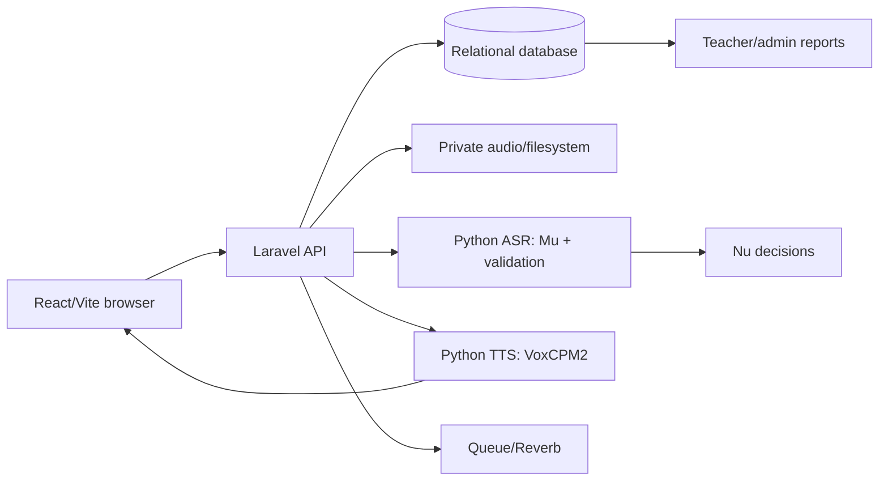
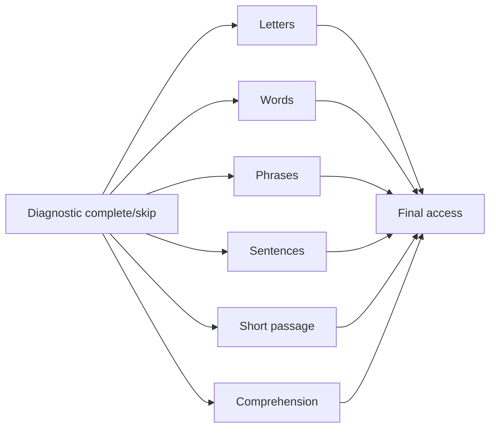
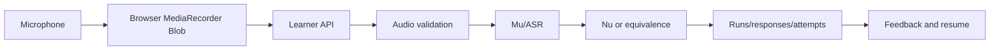
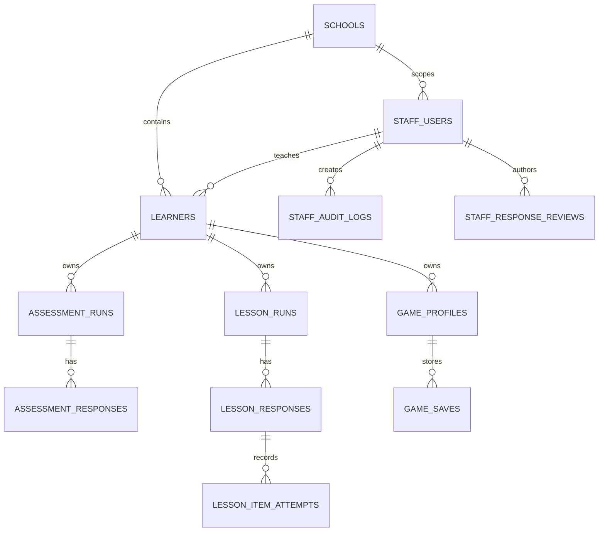

# ReaDirect Complete System Analysis

## 1. Executive Summary

ReaDirect is a browser-based reading intervention that guides learners from letter recognition through comprehension. A React/Vite client serves learner, teacher, school-administrator, and system-administrator portals. A Laravel API owns authentication, authorization, progression, assessment and lesson runs, content snapshots, scoring, reporting, and persistence. Python services provide speech recognition (ASR/Mu/Nu) and local text-to-speech (TTS). The development database is the Laravel relational schema with a SQLite file currently present.

Core learner and staff workflows are implemented, including diagnostic/final assessment, six lessons, teacher review/reporting, and ASR/TTS boundaries. Game Zero remains a placeholder, academic content management is read-only, and mobile/standalone behavior is only partly evidenced. Server services and persisted runs are authoritative; browser state is presentation/cache state.

Key source paths include `apps/web/src/App.tsx`, `apps/api/routes/api.php`, `apps/api/app/Services`, `services/asr/app/mu.py`, and `services/tts/main.py`.

## 2. Technology Stack

| Layer                | Technology                                       | Purpose                             |
| -------------------- | ------------------------------------------------ | ----------------------------------- |
| Web                  | React, TypeScript, Vite, React Router            | Browser portals                     |
| Client data          | TanStack Query, React context, storage           | Cache, sessions, UI state           |
| API                  | PHP Laravel, Eloquent, PHPUnit                   | HTTP/domain/persistence             |
| Database             | Laravel relational schema; SQLite in development | Identity, runs, responses           |
| Speech               | Python service, faster-whisper                   | Mu transcription and validation     |
| Deterministic speech | Nu plus Laravel equivalence/alignment            | Letter and expected-aware decisions |
| TTS                  | Python VoxCPM2 service                           | Clara speech                        |
| Queue/realtime       | Laravel queue and Reverb                         | Jobs and staff updates              |
| Browser audio        | getUserMedia and MediaRecorder                   | Recording/playback                  |
| Tests                | PHPUnit, Vitest, Playwright, pytest              | Automated verification              |

## 3. Repository Structure

```text
apps/api/                 Laravel application, routes, migrations, tests
apps/web/                 React/Vite application and browser tests
services/asr/             Mu/ASR service and model artifacts
services/tts/             VoxCPM2 service and cache
docs/                     Architecture and manuscript documents
scripts/                  Launch/catalog helpers
start.ps1, stop.ps1       Local service orchestration
```

API domain code is under apps/api/app, routes under apps/api/routes, and schema under apps/api/database. Client feature code is under apps/web/src/features; app providers and routing are under apps/web/src/app and apps/web/src/App.tsx. ASR and TTS are independent processes.

## 4. Application Startup

apps/web/src/main.tsx mounts AppProviders, BrowserRouter, and App. apps/web/src/app/AppProviders.tsx installs theme, query, staff lifecycle, and realtime providers. apps/web/src/App.tsx defines public, learner, and staff routes.

apps/api/bootstrap/app.php bootstraps Laravel API, health, and broadcast routes. start.ps1 currently launches Vite on 5174, Laravel on 8000, Reverb on 8080, a queue worker, ASR on 8001, and TTS on 8002; it sets MU_DEVICE=cpu and runs migrations. ASR readiness is /live and /ready in services/asr/main.py; TTS has a separate readiness path. No recurring academic job was found.

## 5. High-Level Architecture



The browser does not access the database or model files directly. Laravel is the authenticated integration boundary; Python services are internal except for health endpoints.

## 6. Frontend Architecture

apps/web/src/App.tsx groups public, learner, and staff routes. Learner routes include login, dashboard, Clara intro, diagnostic/final assessment, lessons 1–6, and games. Staff routes are nested by teacher, school_admin, and system_admin.

TanStack Query defaults in apps/web/src/app/queryClient.ts use 30 seconds stale time, one query retry, and no mutation retry. Providers own theme, staff heartbeat/lifecycle, and realtime. Feature components own interaction state; learnerApi.ts and staffApi.ts centralize requests. RequireStaffRole is a navigation guard, not the authorization authority.

## 7. Backend Architecture

Laravel bootstrap/middleware establish headers, throttles, and broadcasts. Controllers in apps/api/app/Http/Controllers are boundary adapters; services implement progression, assessment, lesson, reporting, speech, reset, and content rules. Eloquent models map the schema. AppServiceProvider applies production security/rate limits and avoids destructive migrations at boot.

Assessment and lesson services create immutable snapshots, persist responses/attempts, and expose resumable runs. Staff services scope data by teacher_id or school_id.

## 8. Authentication

Learner auth uses LearnerAuthController, LearnerSessionResolver, and learnerApi.ts. A five-character [A-Za-z]{2}\d{3} code is uppercased and checked against an active learner with a dummy hash. A SHA-256 token hash is stored; sessions live 12 hours, idle-expire after 60 minutes, and are limited to five. Token and snapshot are in sessionStorage under readirect.learner-session. There is no self-registration or learner recovery.

Staff auth uses StaffAuthController, StaffSessionResolver, RequireStaffRole, and staffApi.ts. Non-remembered sessions last eight hours; remembered sessions last 30 days and use a device HMAC. A 120-second lease, heartbeat, verification codes, and audit entries exist. Non-remembered state is sessionStorage; remembered state is localStorage. staffFetch clears state on 401. No public forgot-password route was found.

## 9. Roles and Authorization

| Role         | Capabilities                                           | Server enforcement                        |
| ------------ | ------------------------------------------------------ | ----------------------------------------- |
| learner      | Own dashboard, assessments, lessons, games             | Learner resolver and learner_id ownership |
| teacher      | Own learners, credentials, reviews, reports            | Teacher scope and role middleware         |
| school_admin | School classes, teachers, learners, insights           | school_id scope                           |
| system_admin | Directories, monitoring, speech tools, settings, audit | System-admin middleware                   |
| guest        | Database foundation only                               | No active public login found              |

Backend session/object checks are authoritative; frontend guards only shape navigation.

## 10. Learner System

After code login, the learner dashboard loads progress and recent activity. Intro/Clara establishes listening context, then diagnostic or an available lesson is opened. Lesson and assessment pages resume server-side runs after refresh or device changes. Audio, transcripts, attempts, scores, and completion are written by the API.

## 11. Academic Progression

The intended path is Diagnostic → Letters → Words → Phrases → Sentences → Short Passage → Comprehension → Final Assessment. Once diagnostic is completed or skipped, lessons 1–6 are independently accessible; numbered sequence is not enforced. Final access requires all six distinct lesson keys completed. LearnerReadingPathService, LearnerLessonAccessService, LearnerLessonCompletionService, and LearnerFinalAssessmentAccessService are authoritative. Browser menu order and derived booleans are presentation only.



## 12. Diagnostic Assessment

Diagnostic and final share part-one/part-two controllers/pages, distinguished by assessment type. AssessmentContentCatalog loads active CSV rows, sorts deterministically, and snapshots content into the run.

Part one requires orientation audio (25 MB maximum), ASR readiness, and usable quality. Task 1A uses Nu; Task 2A is a rhyme choice; Task 2B uses Mu and SpeechEquivalenceResolver. A skipped task persists zero. If Task 1A ≤6, Task 2A runs, Task 2B is auto-zeroed, and the run completes after part one. Above 6, Task 2B runs, Task 2A is auto-10, and part two follows. Bands are Full Refresher ≤10, Moderate Refresher ≤16, Light Refresher ≤26, otherwise Grade Ready.

## 13. Final Assessment

Final access is checked against six completed lessons. Part two selects one immutable story from two entries. Passage audio is capped at 50 MB, transcribed by Mu, and aligned by Laravel equivalence; incorrect words are capped at 50 and accuracy is 100 − 2×incorrect. Five comprehension choices supply the other component. Final score is rounded 60% comprehension + 40% accuracy. Profiles are Low Emerging Reader ≤25, High Emerging ≤50, Developing ≤75, Transitioning ≤90, otherwise Reading at Grade Level.

## 14. Assessment Tasks and Branching

| Task | Input/interpreter              | Branch or score               |
| ---- | ------------------------------ | ----------------------------- |
| 1A   | Letter recording / Nu          | Controls low/high branch      |
| 2A   | Rhyme choice / answer key      | Low branch; auto-10 on high   |
| 2B   | Word recording / Mu + resolver | High branch; auto-zero on low |
| 3A   | Passage / Mu + alignment       | Accuracy component            |
| 3B   | Five choices / answer key      | Comprehension component       |

LearnerAssessmentAsr maps unavailable/malformed service responses to runtime failures. Unusable audio is rejected as a client error; individual spoken items may score zero on SILENCE/UNUSABLE rather than gate the entire run.

## 15. Lesson Architecture

LessonContentCatalog reads active CSV content. lesson_runs contain immutable snapshots; lesson_target_exposures track presentation. lesson_responses and lesson_item_attempts preserve response, audio, transcript, evidence, and retry kind.

LessonTeachingStateMachine covers listening, feedback, clue, guided retry, demonstrating, echo, review, and advancing, with up to two academic and two technical retries. Lesson 1 and 6 have custom controllers; spoken lessons use shared orchestration.

## 16. Lesson 1 — Letters

Route /learner/lessons/1. LearnerLessonOneController and LessonOnePage present 15 items (three missions of five). Nu decides letters. Attempts can be independent, guided, echo, technical, or skip; evidence and completion persist through lesson APIs. Letter Leader is awarded on completion.

## 17. Lesson 2 — Words

Route /learner/lessons/2. LearnerLessonTwoController and LessonTwoPage present two groups of five words. Mu transcribes and SpeechEquivalenceResolver determines expected-aware correctness. Shared recording, retry, persistence, and resume behavior apply.

## 18. Lesson 3 — Phrases

Route /learner/lessons/3. LearnerSpokenTextLessonController and SpokenTextLessonPage present five phrases. Mu, phrase equivalence, retry state, and persisted attempts provide feedback and completion.

## 19. Lesson 4 — Sentences

Route /learner/lessons/4. The shared spoken-text page presents five sentences. Audio validation, Mu, sentence equivalence, retry state, and server-owned completion match lessons 2–3.

## 20. Lesson 5 — Short Passage

Route /learner/lessons/5. The shared page presents one passage and a review/accuracy phase. It has a clear-recording terminal result, then persists Mu/alignment evidence and completion.

## 21. Lesson 6 — Comprehension

Route /learner/lessons/6. LearnerLessonSixController and LessonSixPage present five who/what/where/when/why choices. It is choice-only: no recorder, Mu, Nu, or audio upload. Answers and completion use the lesson run API.

## 22. Content Management

AssessmentContentCatalog and LessonContentCatalog read active CSV rows. New source versions affect future runs; immutable snapshots protect in-progress runs. SystemAdminLearningContentController is read-only; no academic create/edit/publish endpoint was found.

TTS has a separate draft/published catalog with seeders and apps/api/scripts/publish-staged-tts-catalog.php. It publishes speech lines, not academic lesson content.

## 23. Recorder Architecture

AssessmentRecorder.tsx renders the recorder and useAudioRecorder.ts owns idle, recording, recorded, and playing state. getUserMedia obtains a stream; MediaRecorder collects chunks; object URLs support playback; tracks stop during cleanup. Recordings under 500 ms are rejected and optional maximum duration is enforced. Permission/playback failures are generic UI errors.

Assessment pages send the Blob to the API. The API stores private audio, validates quality, calls ASR, interprets the transcript, writes response/evidence, and returns score/feedback. Failures before commit can retry; completed responses are not silently overwritten.

## 24. Recorder UI Architecture

AssessmentRecorder.tsx renders .assessment-recorder**control[data-state], .assessment-recorder**icon, SVG mic/play icons, a span.assessment-recorder\_\_stop-icon, labels, bars, retry, and error text. Ownership is in apps/web/src/features/assessment/assessment.css.

The base control is a circular grid item with width clamp(9.6rem,42vw,11.25rem), aspect-ratio 1, four-pixel border, padding, and shadow. Icon wrapper/SVG is about 2.8rem; stop mark is 2rem. Landscape reduces the control to roughly min(25svh,7rem). Verified issue: the button centers the wrapper, but the stop child is not centered within that wrapper, so it can start upper-left in compact layouts. No fix was made.

## 25. Audio Pipeline



Python removes temporary ASR uploads. Laravel stores private path/hash references and evidence. No complete historical retention scheduler was found.

## 26. Audio-Quality Validation

services/asr/app/audio.py decodes to 16 kHz mono and rejects audio shorter than .25 seconds, over the maximum duration, RMS below −45 dB, or mostly silent (silence ratio ≥.92). Clipping ratio ≥.01 is a warning; noise profiling can flag background noise. The service accepts wav/mp3/m4a/webm/ogg/flac and limits uploads to 25 MB; VAD is disabled.

Orientation rejects audio_quality.usable=false. Spoken item quality does not consistently gate scoring, so SILENCE/UNUSABLE can become zero. Physical microphone quality, every browser codec, and production retention remain UNCONFIRMED.

## 27. Mu

services/asr/app/mu.py uses faster-whisper behind protected ASR endpoints. /live and /ready are public health checks; other requests require an internal bearer token. Uploads are bounded, temporary files are cleaned, and a single-concurrency queue limits wait and evaluation time.

The current working code advertises/downloads base.en (services/asr/app/mu.py and scripts/cache-models.py) because the laptop cannot run the original large-v3-turbo. Existing model_artifacts/mu metadata/runtime-config still name large-v3-turbo; cached tiny.en and large-v3-turbo directories exist. \_local_source searches model artifacts before the .cache/faster-whisper-base.en directory, while start.ps1 sets MU_DEVICE=cpu but not MU_MODEL_PATH. The intended base.en migration is CONFIRMED, but the exact checkpoint selected by default startup is HIGH-RISK/UNCONFIRMED.

## 28. Nu

Nu is deterministic logic bundled with Mu, not a second neural model. It normalizes letter-like speech, uses aliases/reviewed equivalences, and emits A–Z, SILENCE, or UNKNOWN decisions with evidence. It serves diagnostic Task 1A, Lesson 1, and the system-admin sandbox. Nu owns letter correctness; Mu supplies transcript evidence.

## 29. Transcript Processing

The effective pipeline is raw audio → raw Mu transcript/segments → normalized text → expected-aware equivalence → alignment/score transcript → persisted evidence. SpeechEquivalenceResolver is authoritative for words, phrases, sentences, and passage tokens. TranscriptAlignmentService contains a second alignment implementation for pedagogical diagnosis and is DUPLICATED LOGIC; changes must be compared with the resolver.

Raw and normalized transcript/evidence JSON are retained with responses or attempts. Python comparison output is diagnostic evidence, not the final academic result.

## 30. Scoring Architecture

Laravel services own scoring and persistence. Task 1A uses Nu; choices use catalog answer keys; spoken tasks use SpeechEquivalenceResolver and alignment. Final scoring combines comprehension and passage accuracy in Laravel. Frontend displays derive from API responses.

Presentation progression booleans, current_required_lesson_order, and pedagogical alignment are alternate-looking paths. They are DUPLICATED LOGIC or presentation state, not authorities.

## 31. Ma'am Clara

Clara is a Live2D/intro experience under apps/web/src/features/intro/live2d. claraSpeech.ts and readiness hooks coordinate prompts, listening sessions, and transitions. LearnerTtsController serves fixed catalog audio and dynamic lines. Frontend stops playback before record, submit, navigation, support, and cleanup. Clara does not own scores or progression.

## 32. Text-to-Speech

services/tts/main.py loads local VoxCPM2 from .cache/models/openbmb--VoxCPM2, accepts text/reference/language/profile data, and emits PCM16 WAV. References include assets/audio/voice-references/sh and sh-fil. A single queue/generation lock serializes work; cache keys include text, reference, language, and fingerprint. Fixed published audio and dynamic lines coexist. No separate acoustic-echo-cancellation profile was confirmed.

## 33. Teacher System

Teacher routes support learner CRUD/import, credential creation/reset, learner detail, diagnostic/final review, analytics, reports, and private audio review. TeacherReportService scopes by teacher_id, uses latest runs, and accounts for six-lesson completion, skips, and reviews. TeacherAudioReviewController serves private/no-store audio and additive reviews; canonical_records_changed=false prevents score mutation.

## 34. Administrator System

School admins manage school classes, teachers, learners, insights, reports, and dashboards under school_id. System admins manage directories, settings, audit/monitoring, games/players, guests, speech sandbox/equivalence/confusion tools, and a system learner portal. Learning-content inspection is read-only; academic publish/write endpoints were not found.

## 35. API Architecture

apps/api/routes/api.php contains approximately 154 routes grouped into these families:

| Domain                | Representative boundary                                 | Auth/scope                               |
| --------------------- | ------------------------------------------------------- | ---------------------------------------- |
| Learner auth/progress | learner auth/session/dashboard controllers              | Learner session                          |
| Assessments           | part one/two, upload, skip, complete                    | Learner run ownership                    |
| Lessons               | start/item/respond/complete controllers                 | Learner run ownership                    |
| Speech                | ASR client, TTS controller, sandbox/equivalence tools   | Learner, system-admin, or internal token |
| Teacher               | learner CRUD/import/reset, reviews, reports, audio      | Teacher scope                            |
| School admin          | school/class/teacher/learner and insights               | School scope                             |
| System admin          | directories, settings, audit, games, content inspection | System-admin                             |
| Health/realtime       | health and broadcast routes                             | Route-specific                           |

Frontend API modules are contract clients; controllers delegate rules to services. Exact endpoint names should be read from routes/api.php before adding integrations.

## 36. Database Architecture

Identity and scope tables include staff_users, schools, learners, learner_sessions, learner_progress_states, staff_sessions, and staff_verification_codes. Academic tables include assessment_runs, assessment_responses, lesson_runs, lesson_responses, lesson_item_attempts, lesson_target_exposures, and learner_achievements. Review/reporting tables include staff_response_reviews and staff_audit_logs. Games/guests/TTS/queue tables include game_catalog, game_profiles, game_saves, guest_accounts, guest_sessions, tts_voice_versions, tts_speech_lines, jobs, and failed_jobs.



JSON snapshots/evidence, transcript text, audio paths/hashes, scores, identity fields, and audit metadata are sensitive. staff_response_reviews is polymorphic (response_kind/response_id) without a conventional foreign key. LearnerProgressResetService deletes audio paths from assessment/lesson response rows but does not enumerate historical lesson_item_attempts.audio_path, creating a HIGH-RISK orphan-retention possibility.

## 37. Authoritative Ownership Matrix

| Concern                       | Authoritative owner                       | Main implementation                                   | Persistence                    |
| ----------------------------- | ----------------------------------------- | ----------------------------------------------------- | ------------------------------ |
| Authentication                | Session controllers/resolvers             | LearnerSessionResolver, StaffSessionResolver          | Session tables + browser token |
| Authorization                 | Middleware and scoped services            | RequireStaffRole and controllers                      | Request context                |
| Learner profile               | Learner model/services                    | learner controllers                                   | learners                       |
| Academic progression          | Reading-path/access services              | LearnerReadingPathService and access services         | progress/runs                  |
| Assessment run                | Assessment run service                    | assessment controllers/services                       | assessment_runs                |
| Assessment scoring            | Laravel scoring/equivalence               | SpeechEquivalenceResolver                             | response score/evidence        |
| Lesson completion             | Lesson completion service                 | LearnerLessonCompletionService                        | lesson_runs                    |
| Content                       | Catalog loaders and snapshots             | AssessmentContentCatalog, LessonContentCatalog        | CSV + snapshot JSON            |
| Recorder state                | React hook/component                      | useAudioRecorder, AssessmentRecorder                  | Browser memory                 |
| Audio                         | API/private filesystem + ASR temp handler | ASR client/service                                    | path/hash and temporary        |
| Audio quality                 | Python validator + Laravel gate           | audio.py and assessment service                       | quality evidence               |
| Raw transcript                | ASR result                                | services/asr                                          | response/attempt evidence      |
| Normalized/scoring transcript | Resolver/alignment                        | SpeechEquivalenceResolver, TranscriptAlignmentService | response evidence              |
| Mu/Nu                         | Python service                            | mu.py and deterministic Nu                            | model cache/decision evidence  |
| Clara/TTS                     | React orchestration + TTS service         | claraSpeech.ts, services/tts/main.py                  | catalog/cache                  |
| Research data                 | No dedicated subsystem confirmed          | operational response/report tables                    | Operational data only          |

## 38. Frontend State Management

TanStack Query owns server cache freshness and invalidation. React context owns theme, staff lifecycle, and realtime. Assessment/lesson components own current item, recorder state, retry phase, local errors, and playback. Session snapshots bridge browser storage to the API but do not authorize requests. XState is a dependency with no runtime imports found: POSSIBLY UNUSED.

## 39. Persistence and Resume Behavior

| State/data                     | Memory        | Browser storage | Server/DB                | Refresh          | Device change       |
| ------------------------------ | ------------- | --------------- | ------------------------ | ---------------- | ------------------- |
| Recorder stream/chunks         | Yes           | No              | No until upload          | Lost             | Lost                |
| Learner token/snapshot         | No after load | sessionStorage  | Hashed session           | Same tab resumes | New login           |
| Remembered staff token         | No after load | localStorage    | Staff session/device     | Resumes          | Device dependent    |
| Assessment run/content         | No            | No              | assessment_runs snapshot | Resumes          | Resumes after login |
| Lesson attempts/audio/evidence | No            | No              | lesson tables            | Resumes          | Resumes             |
| Query cache                    | Yes           | No              | API source               | Refetches        | Refetches           |
| TTS cache                      | No            | No              | TTS filesystem           | Host-persistent  | Host dependent      |

## 40. Research Data

Research language and operational evidence exist in assessment/lesson responses, attempts, transcripts, audio references, staff reviews, and reports. No participant, consent, de-identification, study-arm, research-export, or CRLA-specific schema/API was found. Such requirements are UNCONFIRMED and are not presented as implemented.

## 41. Privacy and Security Architecture

Hashed tokens, password/dummy hashes, backend object/role checks, private/no-store audio, internal service tokens, size limits, security headers, rate limiting, and staff audit logging are CONFIRMED. Risks include indefinite historical audio references, remembered staff tokens in localStorage, weaker login limiter symmetry than learner codes, deferred upload content validation, same-origin/CORS assumptions, and polymorphic reviews without foreign keys. This is an architecture summary, not a penetration test.

## 42. External Services

Confirmed dependencies are local ASR, local TTS, Laravel queue/Reverb, and the browser microphone. Names include MU_DEVICE, MU_MODEL_PATH, ASR/TTS base URLs, internal service tokens, queue/reverb variables, database settings, and application/Vite URLs. Secret values are omitted. cstart.ps1 exposes Vite through Cloudflare staging only; no external cloud speech provider was confirmed.

## 43. Configuration

Inspect .env.example, apps/api/config, Vite environment usage, services/asr settings, services/tts settings, and start.ps1. Important variable names are APP*ENV, APP_URL, DB*_, queue/broadcast variables, ASR\__, TTS\_\*, MU_DEVICE, MU_MODEL_PATH, internal bearer tokens, and Vite public API/realtime URLs. Never document local secret values.

## 44. Testing Architecture

apps/api/tests contains 66 Laravel test files; web tests number 84 with eight Playwright E2E suites; ASR has three test areas and TTS two. Targeted verification passed 38 Laravel tests/303 assertions, 11 assessment component tests, 19 ASR tests, and 20 TTS tests. Broad web and Composer runs timed out without output. php artisan test is not defined; Composer/PHPUnit is the entry point.

Game One has substantial tests, Game Alpha has a small suite, and Game Zero has no local package test suite. Important gaps are real Mu checkpoint accuracy, real VoxCPM generation, recorder permissions/MIME across browsers, physical devices/WebViews, retention/reset cleanup, and a complete green full-suite run.

## 45. Error Handling

API helpers parse generic error envelopes. Staff 401 clears staff state; learner dashboard errors clear stale activity, while activity pages may show generic errors. Recorder denial, short recordings, playback, ASR malformed/unavailable, TTS readiness, missing content, and transaction failures have separate paths. Runs resume when an open server run exists; failures before commit can retry.

## 46. Logging and Audit

staff_audit_logs records staff security and administrative actions. Python services write process logs; local launcher output is under .runtime/logs. No centralized Laravel retention configuration was confirmed. Sandbox/service outputs can include transcript text and audio references, so logs are sensitive.

## 47. Responsive Architecture

The shell uses viewport-fit=cover, safe-area insets, hidden overflow in several shells, fixed controls, and 100vh/100svh combinations. Assessment CSS uses clamp sizing and short-height landscape rules. System Chrome checks covered desktop, laptop, tablet landscape/portrait, and phone portrait/landscape: public pages had no horizontal overflow, but phone-landscape public/home and learner-login pages exceeded short height and learner-login controls can be offscreen. The mocked assessment speech page had no horizontal overflow. No physical-device certification is claimed.

## 48. Phone / Standalone Mode

Repository evidence supports normal browser operation only. No manifest, service-worker registration, standalone display mode, Capacitor/Cordova/WebView/TWA wrapper, or fullscreen host was confirmed; PWA/Workbox dependencies are unwired. There is no separate phone/standalone code path. Actual deployment host behavior remains UNCONFIRMED.

## 49. Legacy / Duplicate / Possibly Unused Code

| Area                            | Status                | Evidence                                           | Risk                         |
| ------------------------------- | --------------------- | -------------------------------------------------- | ---------------------------- |
| current_required_lesson_order   | LEGACY                | Backend allows independent lessons                 | False sequencing can return  |
| Frontend progression fallbacks  | DUPLICATED LOGIC      | Derived menu booleans                              | UI/server disagreement       |
| Mu metadata versus base.en code | HIGH-RISK AREA        | Large-v3-turbo metadata and base.en loader coexist | Wrong checkpoint             |
| Transcript alignment            | DUPLICATED LOGIC      | Resolver plus alignment service                    | Drift in score/feedback      |
| Lesson orchestration            | DUPLICATED LOGIC      | Custom lessons plus shared controller              | Inconsistent fixes           |
| XState                          | POSSIBLY UNUSED       | No runtime imports                                 | Misleading architecture      |
| PWA/Workbox                     | POSSIBLY UNUSED       | No manifest/service worker                         | Do not call app PWA          |
| Game Zero                       | PARTIALLY IMPLEMENTED | Route/UI placeholder and dormant metadata          | Bounded removal needed       |
| Guest foundation                | PARTIALLY IMPLEMENTED | Tables/routes, no public login                     | Unsupported-flow assumptions |

## 50. Important End-to-End Flows

1. Learner login: browser submits code → Laravel normalizes/checks learner → hashed session token → dashboard requests.
2. Diagnostic: start/snapshot catalog → orientation quality gate → Nu and branch tasks → persist score → expose lessons.
3. Spoken lesson: start/resume run → record Blob → upload → quality/ASR/Mu → expected-aware equivalence → persist attempt → retry/feedback → complete.
4. Final: verify six lesson keys → snapshot story → passage alignment + comprehension → combine score/profile → complete.
5. Teacher review: scoped report/audio request → private audio or additive review → audit without canonical mutation.
6. Clara: stop conflicting playback → request fixed/dynamic TTS → cached/generated WAV → playback → cleanup.

## 51. Known Remaining Work

### 51.1 Remove Game Zero

Game Zero has a frontend route/skeleton and dormant catalog/metadata references; no active academic backend or dedicated model was found. Future removal should inventory web game routes/components, navigation/tests, and system-admin metadata, then delete only dead references. Database impact appears none beyond dormant catalog rows. Estimated small-to-medium scope; MEDIUM risk.

### 51.2 Recorder Button Shape

AssessmentRecorder and shared assessment.css affect diagnostic, final, and spoken lessons. The safe boundary is local clamp/aspect-ratio/short-height CSS and component measurements. A global redesign is HIGH risk because all recorder consumers share it.

### 51.3 Stop Icon Centering

The verified root cause is the centered button/grid wrapper combined with an uncentered fixed-size stop child. Compact wrappers can be smaller than the stop mark. Future correction should remain within recorder markup/icon wrapper/CSS; no API, scoring, or state change is necessary.

### 51.4 Phone / Standalone Responsiveness

Observed issues are short-height browser layouts, chiefly public/home and learner-login in phone landscape, not a confirmed standalone shell. First identify the real host, then inspect route-specific overflow, fixed controls, svh/dvh, safe areas, keyboard resize, and orientation. Keep local fixes separate from shared recorder rules.

## 52. Change-Risk Map

| Risk      | Areas                                                                  | Reason                                                    |
| --------- | ---------------------------------------------------------------------- | --------------------------------------------------------- |
| VERY HIGH | Sessions, authorization, progression, scoring, equivalence, migrations | Changes access, academic results, or historical data      |
| HIGH      | Recorder CSS, Mu resolution, audio retention, transcript alignment     | Cross-screen, model, privacy, or duplicated-logic effects |
| MEDIUM    | Catalogs, TTS publication, reports, responsive shells                  | Snapshot/report/UI compatibility                          |
| LOW       | Isolated read-only documentation/inspection                            | No canonical data when isolated                           |

## 53. Important Files by Domain

| Domain      | Primary files                                 | Related files                |
| ----------- | --------------------------------------------- | ---------------------------- |
| Startup     | start.ps1, main.tsx, bootstrap/app.php        | stop.ps1, cstart.ps1         |
| Auth        | learner/staff auth controllers and resolvers  | learnerApi.ts, staffApi.ts   |
| Progression | reading-path/access/completion services       | App.tsx                      |
| Assessments | assessment controllers/services/catalogs      | assessment pages/tests       |
| Lessons     | lesson controllers and state machine          | lesson pages/catalog         |
| Recorder    | AssessmentRecorder.tsx, useAudioRecorder.ts   | assessment.css               |
| ASR/Mu/Nu   | services/asr/main.py, app/mu.py, app/audio.py | cache-models.py              |
| TTS/Clara   | services/tts/main.py, claraSpeech.ts          | TTS controller/catalog       |
| Staff/admin | scoped controllers/services                   | route middleware/API modules |
| Database    | migrations/models                             | reset/report services        |

## 54. Future-Agent Navigation Guide

| If changing...     | Start here                          | Also inspect                        | Risk        |
| ------------------ | ----------------------------------- | ----------------------------------- | ----------- |
| Authentication     | session controllers/resolvers       | middleware, migrations, API clients | VERY HIGH   |
| Authorization      | RequireStaffRole/scoped controllers | policies, services, routes          | VERY HIGH   |
| Progression        | reading-path/access services        | dashboard/menu derivations          | VERY HIGH   |
| Diagnostic/final   | assessment services/controllers     | pages, catalogs, tests              | VERY HIGH   |
| Lessons            | state machine/controller            | each lesson page/catalog            | HIGH        |
| Content            | catalog loaders/seeders             | snapshot schema                     | MEDIUM      |
| Recorder           | component/hook                      | assessment.css, all consumers       | HIGH        |
| Audio              | ASR client/audio.py                 | limits, temp cleanup, tests         | HIGH        |
| Mu/Nu              | mu.py and deterministic logic       | cache script, metadata, launcher    | VERY HIGH   |
| Transcript/scoring | resolver/alignment                  | report consumers/tests              | VERY HIGH   |
| Clara/TTS          | claraSpeech.ts and TTS service      | catalog/cache                       | HIGH        |
| Teacher/admin      | scoped services/controllers         | middleware/reports                  | HIGH        |
| Database           | migrations/models                   | reset/report services               | VERY HIGH   |
| Responsive         | owning page/CSS                     | shared shells/browser checks        | MEDIUM/HIGH |
| Phone/standalone   | deployment host first               | viewport/safe-area CSS              | HIGH        |
| Game Zero          | route/catalog references            | navigation/tests/admin metadata     | MEDIUM      |

## 55. Unconfirmed Areas

- Exact Mu checkpoint selected by default while base.en, tiny.en, and large-v3-turbo artifacts coexist.
- Production ASR/TTS topology, GPU availability, and real model accuracy.
- Physical device/browser permission, codec, keyboard, and WebView behavior.
- Any deployment wrapper adding standalone/fullscreen behavior.
- Complete audio retention/garbage collection and orphan cleanup.
- Centralized log retention, deployed CORS/edge headers, and external monitoring.
- Research consent, participant/de-identification/export subsystem.
- Full test-suite result after broad runs timed out.

## 56. System Health Summary

### Stable / Well-Defined

Session/role boundaries, immutable run snapshots, core learner flows, lesson retry state, teacher scoping, private audio responses, and targeted tests are clearly represented.

### Fragile / Highly Coupled

Shared recorder CSS/markup, short-height layouts, Mu model discovery, audio retention/reset, transcript alignment, and report queries.

### Partially Implemented

Game Zero, guest foundation, academic content administration, research data, and standalone/mobile wrapper.

### Duplicated

Frontend progression derivations, transcript alignment, and lesson-specific orchestration alongside shared infrastructure.

### Possibly Legacy

current_required_lesson_order, stale large-v3-turbo metadata, unwired XState/PWA/Workbox/deployment packages, and dormant game/guest paths.

### Important Untested Areas

Real model accuracy/checkpoint selection, physical devices/WebViews, microphone/codec edge cases, retention/reset cleanup, and a complete green test suite.

### Areas Future Agents Must Not Modify Casually

Do not casually change session lifetime/ownership checks, progression services, assessment branching/scoring, equivalence/alignment, immutable snapshots, recorder shared CSS, Mu model resolution, audio retention, migrations, or school/teacher report scopes. Verify the authoritative owner before editing.
