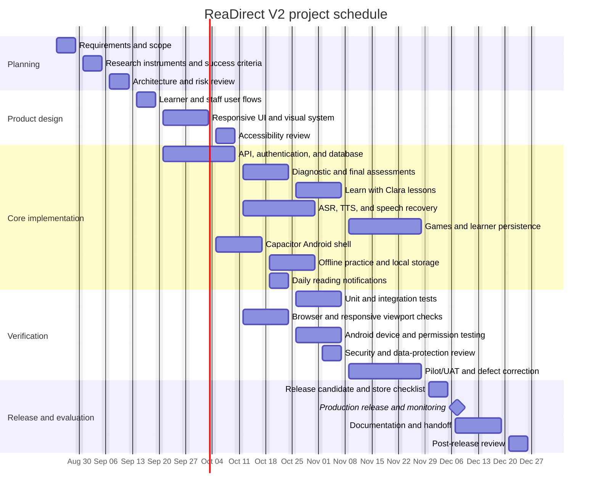

# ReaDirect Project Schedule

**Status:** Draft baseline — replace the dates with the approved school/project calendar.  
**Last updated:** 2026-08-23  
**Owner:** ReaDirect project team

This document provides a visual project schedule for ReaDirect V2. It is written
in Markdown with a Mermaid Gantt chart so it can be previewed in GitHub,
GitLab, VS Code, or any Markdown viewer that supports Mermaid.

## Gantt chart



## Schedule legend

| Marker | Meaning |
| --- | --- |
| `plan_*` | Planning and research tasks |
| `design_*` | UX, visual design, accessibility, and interaction decisions |
| `impl_*` | Application, API, database, mobile, and service implementation |
| `qa_*` | Automated, browser, device, security, and pilot verification |
| `release_*` | Release, handoff, monitoring, and evaluation |
| `milestone` | A release event rather than a multi-day task |

## Deliverables by phase

| Phase | Primary deliverable | Acceptance evidence |
| --- | --- | --- |
| Planning | Approved scope, requirements, risks, and success criteria | Signed scope or approved issue set |
| Product design | Learner/staff flows and responsive UI decisions | Design review and accessibility checklist |
| Core implementation | Working web/mobile features, API contracts, and persistence | Typecheck, unit tests, and feature tests |
| Verification | Regression, responsive, Android, security, and pilot results | Test reports with pass/fail evidence |
| Release | Build artifact, store checklist, monitoring, and rollback notes | Release approval and deployment record |
| Evaluation | Updated technical and research documentation | Final report and stakeholder sign-off |

## How to update the chart

1. Replace the draft dates in the Mermaid block with the approved dates.
2. Keep task IDs stable (`plan_scope`, `impl_api`, and so on) so links and reviews remain easy to follow.
3. Add `done` before a task ID when a task is complete, for example:

   ```text
   Requirements and scope :done, plan_scope, 2026-08-24, 5d
   ```

4. Use `after <task-id>` when a task should begin after another task instead of hard-coding a date.
5. Record major changes in the revision history below.

## Revision history

| Date | Change | Owner |
| --- | --- | --- |
| 2026-08-23 | Created the draft ReaDirect V2 Gantt schedule. | ReaDirect project team |

